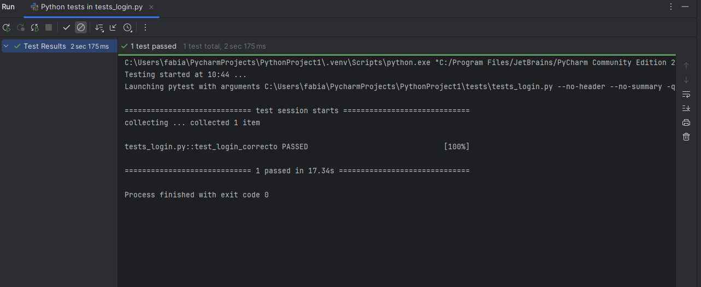
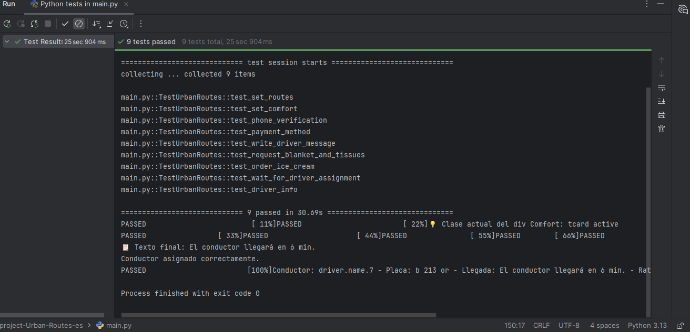
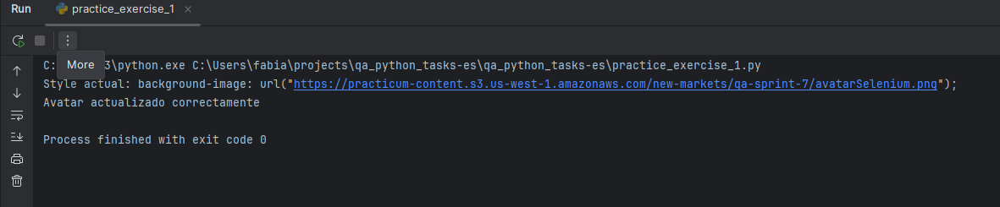
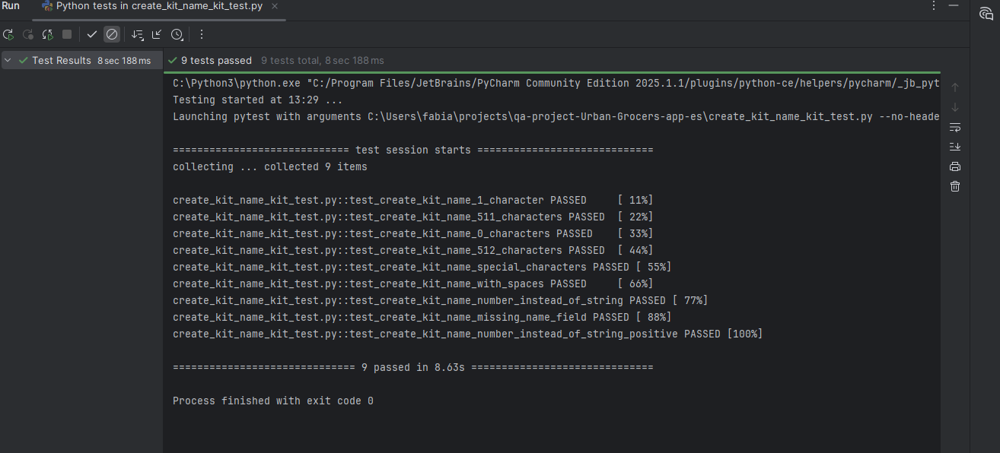

<strong>QA Engineer — Pruebas Manuales</strong>

---

# Hola, soy Francis Anahole
**QA Engineer** — *Transformando errores en mejoras valiosas para tu software*

Apasionada por garantizar que las aplicaciones funcionen a la perfección para los usuarios. Combino **experiencia en pruebas manuales y automatizadas** con habilidades en **Selenium, Pytest, SQL y Postman**, aportando precisión, análisis crítico y soluciones eficientes a cada proyecto.

  
  
  
  

## Sobre mí

Hace un tiempo decidí dar un giro profesional hacia el mundo de la Calidad de Software (QA). Lo que empezó como un reto personal rápidamente se transformó en una verdadera pasión: garantizar que las aplicaciones funcionen de manera óptima y ofrezcan la mejor experiencia a los usuarios.

Durante mi formación y experiencia en proyectos, he diseñado y ejecutado casos de prueba funcionales y automatizados, identificado errores críticos y contribuido a mejorar la confiabilidad de los sistemas.

🔹 Proyecto destacado: Urban Routes
Implementé pruebas automatizadas con Selenium para optimizar los flujos de solicitud de taxi, lo que aumentó la eficiencia del proceso de validación y redujo tiempos en la detección de errores.

🔹 Proyecto autónomo: Automatización de Login en OrangeHRM Demo
Desarrollé un proyecto desde cero para validar la funcionalidad crítica de inicio de sesión en OrangeHRM Demo.

Implementé scripts automatizados con Selenium y Pytest.

Usé el patrón Page Object Model (POM) para mantener un código limpio y escalable.

Integré WebDriver Manager para la configuración automática del driver de Chrome.

Documenté el flujo de trabajo en el README para que otros puedan reproducir la ejecución de las pruebas.

Hoy combino pruebas manuales y automatizadas con conocimientos en Selenium, Pytest, SQL y Postman, aportando análisis crítico, organización y atención al detalle.

Mi objetivo es seguir creciendo como QA Engineer y colaborar con equipos que busquen mejorar la calidad del software, reducir riesgos y entregar productos de alto valor a sus clientes.

## 🛠 Habilidades Técnicas

- Pruebas Manuales y Automatizadas
- Automatización con Selenium, Pytest y Serenity
- Pruebas de API con Postman y Karate
- Consultas SQL y validación de datos
- Gestión de proyectos y seguimiento con JIRA y GitHub

## 🛠 Habilidades Blandas

- Atención al detalle
- Organización y planificación
- Comunicación efectiva
- Pensamiento analítico y crítico
- Adaptabilidad y aprendizaje rápido
- Trabajo en equipo / colaboración
- Resolución de problemas
- Proactividad y autonomía

## 📂 Proyectos Destacados

###  Automatización de Pruebas de Login en OrangeHRM Demo

El inicio de sesión es una funcionalidad crítica en cualquier aplicación web: si falla, los usuarios no pueden acceder al sistema.
Este proyecto valida automáticamente el inicio de sesión exitoso en la plataforma OrangeHRM Demo, asegurando que el acceso al Dashboard funcione correctamente.

🛠️ Herramientas usadas

  

  

WebDriver Manager – Configuración automática del driver de Chrome

**Mi aporte** 

- Diseñé y desarrollé los scripts de prueba automatizados.
- Implementé el patrón Page Object Model (POM) para separar la lógica de páginas y pruebas.
- Configuré la ejecución de tests con Pytest.

  

 **Repositorio:** [Automatización de Pruebas de Login en OrangeHRM Demo](https://github.com/Francis2040/Test-de-Login-OrangeHRM-Demo)
 

### Urban Routes: Automatización completa del flujo de taxi

Aseguramos que cada paso de la solicitud de taxi funcione de manera confiable, desde elegir origen y destino hasta la verificación de datos del conductor.

**Herramientas**  

  
  
  

**Mi aporte**  
- Creación y mantenimiento de la suite completa de pruebas automatizadas.  
- Implementación de estructura modular con POM para máxima eficiencia.  
- Configuración de datos de prueba y validación de flujos end-to-end, garantizando calidad y fiabilidad.

  

  **Repositorio:** [Automatización completa del flujo de taxi](https://github.com/Francis2040/UrbanRoutes_Automatizacion_Python_Selenium)
  
### Around: Gestión dinámica de tarjetas

Optimización de la gestión de tarjetas en la aplicación Around para agilizar procesos y reducir errores.

**Herramientas**  

  
  
  
  

**Mi aporte**  
- Diseño e implementación de la automatización completa de flujos dinámicos.  
- Estructuración del proyecto bajo POM para fácil mantenimiento y escalabilidad.  
- Validación de la experiencia de usuario y aseguramiento de calidad constante.

### Urban Grocers API: Validación de campos en la API

Automatización de pruebas para asegurar que la API cumpla con los estándares de longitud y formato de datos, garantizando integridad y confiabilidad.

**Herramientas**  

  
  
  

**Mi aporte**  
- Diseño y ejecución de pruebas automatizadas para asegurar datos consistentes.  
- Implementación de autenticación con token y gestión eficiente de la API.  
- Organización de archivos y buenas prácticas para un flujo de trabajo óptimo.

  

**Repositorio:** [Automatización de pruebas Urban Grocers](https://github.com/Francis2040/Automatizacion-de-pruebas-para-validacion-de-campos-en-la-aplicacion-Urban-Grocers)

### Automatización de Pruebas E2E con Serenity BDD y Cucumber en SauceDemo

Demuestra la implementación de pruebas de extremo a extremo (E2E) utilizando Serenity BDD y Cucumber en la aplicación de demostración SauceDemo. Se emplea el patrón Screenplay para una arquitectura de pruebas más modular y mantenible.

**Herramientas**

**Mi aporte**

-Diseñé e implementé pruebas E2E automatizadas usando Serenity BDD y Cucumber, siguiendo el patrón Screenplay para lograr una arquitectura más mantenible y escalable.

-Configuré la gestión de dependencias y ejecución de pruebas con Maven, asegurando que los flujos de prueba fueran reproducibles en cualquier entorno.

-Integré reportes automáticos y detallados con Serenity Reports para facilitar el análisis de resultados y la detección de errores.

-Colaboré en la automatización de CI/CD mediante Jenkins y GitHub Actions, logrando ejecuciones de pruebas automáticas en cada commit.

-Mejoré la eficiencia y confiabilidad del flujo de pruebas, optimizando pasos repetitivos y aumentando la cobertura de escenarios críticos de SauceDemo.

**Repositorio** [Automatizacion-de-Pruebas-E2E-con-Serenity-BDD-y-Cucumber-en-SauceDemo](https://github.com/Francis2040/-Automatizacion-de-Pruebas-E2E-con-Serenity-BDD-y-Cucumber-en-SauceDemo)

